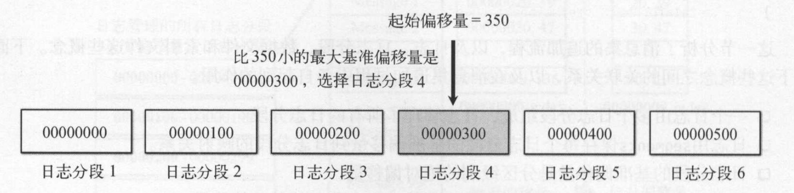
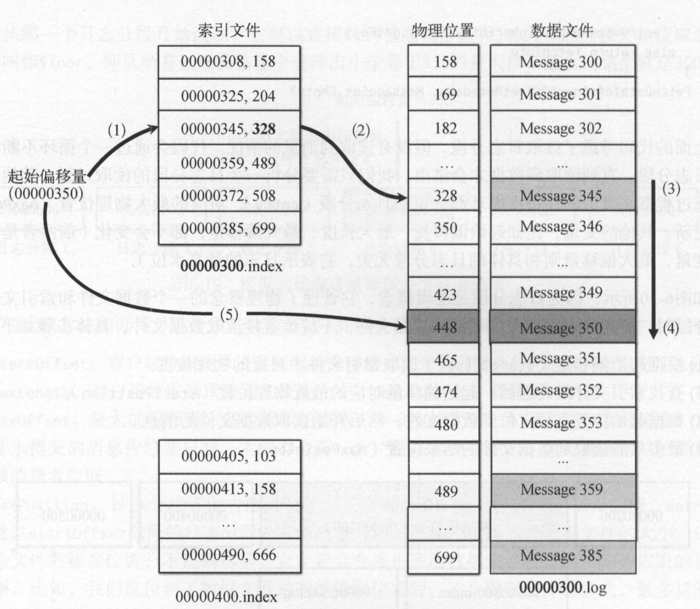

title: Kafka源码解析(7)--存储器的实现原理
layout: post
date: 2018-04-22 21:20:32
comments: true
categories: Kafka源码解析
tags: 
    - 源码解析
    - Kafka
    
keywords: “Kafka”, "源码学习", "中间件"
description: kafka的存储基本单位的分区，kafka采用提交日志的方式作为最终的存储形式。类似的框架有Hbase等。为了提高性能，保证写数据的效率，kafka采用的追加方式，而不是直接修改记录。只保留了一份数据，并且还有一个后台压缩操作，将多条记录压成一条...

---

# 一. 概述
kafka的存储基本单位的分区，kafka采用提交日志的方式作为最终的存储形式。类似的框架有Hbase等。为了提高性能，保证写数据的效率，kafka采用的追加方式，而不是直接修改记录。只保留了一份数据，并且还有一个后台压缩操作，将多条记录压成一条。

**kafka的消息按照主题进行组织，不同类别的消费分成不同的主题。为了提高消息的并行处理能力，每个主题会有多个分区。为了保证消息分区的可用性，每个分区有多个副本**。

为什么要分区？以分区作为存储的基本单位：

 - 如果没有分区，所以的消息只能存储到一个节点上，这样无限制的追加会导致一个节点文件非常的大。还会引入切分的问题。
 - 使用分区也可以提高并行处理能力和吞吐量。多个生产者可以同时向多个分区写数据，多个消费者可以同时从多分分区消费数据。

**一个分区只有一个主副本Leader, 其他副本叫做备份副本。和redis一样，主副本负责读写，备份副本负责向向主副本拉取数据，以便和主副本保持同步。一个代理节点上只能有一个副本（主副本或备份副本）**


# 二. 日志存储
## 2.1 分区副本存储节点分配
客户端访问分区，首先获取分区的主副本，然后找到主副本所在的消息代理节点编号，最后从消息代理节点得写主副本对应的日志文件。每个主副本存储在不同的消息代理节点上，分区的存储的代理节点是由控制器分配的，具体参考 [kafka源码解析(6)--控制器的实现原理](http://zhengjianglong.cn/2018/04/22/kafka/kafka%E6%BA%90%E7%A0%81%E8%A7%A3%E6%9E%90(6)--%E6%8E%A7%E5%88%B6%E5%99%A8%E5%AE%9E%E7%8E%B0%E5%8E%9F%E7%90%86/)。

副本分配算法例如以下： 

 - 将全部N Broker和待分配的i个Partition排序. 
 - 将第i个Partition分配到第(i mod n)个Broker上. 
 - 将第i个Partition的第j个副本分配到第((i + j) mod n)个Broker上.

每一个topic的分区0都会被分配在broker 0上。第1个分区都分配到broker 1上。直到partition的id超过broker的数据才開始从头開始反复，这样会导致前面几台机器的压力比后面的机器压力更大。因此。kafka是先随机挑选一个broker放置分区0，然后再按顺序放置其他分区。

以下图为例, 这里分区0放到了broker5中。分区1–broker6。分区2—broker7….：


## 2.2 存储结构


从存储结构上上，一个分区对应一个文件目录，分区下有多个日志分段(LogSegment), 同一个目录下的所有日志分段都属于同一个分区。

随着日志文件不断增加，为了便于管理和查找，Kafka对分区日志进行分段。当日志文件超过一个阈值后就产生一个新段。**每个日志分段在物理上由一个数据文件和一个索引文件组成**。数据文件存储的是消息的真正内容，而索引文件存储的是数据文件的索引信息。为数据文件建立索引文件的目的是更快地访问数据文件。

生产者些消息到分区时采用追加方式，顺序写磁盘的性能很高。消费者一般情况下也是顺序读取消息，顺序读消息的性能也很高。有时候需要从指定偏移量读取信息，此刻可以用上段索引文件，提高读取性能。

日志和日志分段的主要成员变量：

```
class Log(val dir: File) {
   // 日志包括多个日志分段
   val segments = new ConcurrentSkiplistMap[java.lang.Long, LogSegment]
}

// 分段日志
class LogSegment private[log] (val log: FileRecords,
                               val offsetIndex: OffsetIndex,
                               val timeIndex: TimeIndex,
                               val txnIndex: TransactionIndex,
                               val baseOffset: Long,
                               val indexIntervalBytes: Int,
                               val rollJitterMs: Long,
                               val maxSegmentMs: Long,
                               val maxSegmentBytes: Int,
                               val time: Time) extends Logging 
```

每个日志分段都有一个基准偏移量(baseOffset), 即起始的偏移量，是一个绝对偏移量值。


## 2.3 写日志
kafka写日志采用追加方式，将消息追加到日志后面。每个分区对应的日志管理对象管理了分区的所有日志分段。每次将消息集追加到**当前活动的日志分段**，任何时刻一份分区只有一个活动日志分段。每个分区分段对应一个数据文件和一个索引文件，消息内容会追加到数据文件中。kafka服务端将接受到的消息转换为字节缓冲区的消息集(ByteBufferMessageSet)，操作底层的数据接口是文件通道，消息集的writeFullyTo()方法，调用文件通道的write()方法，将底层包含消息内容的字节缓冲区(ByteBuffer)写到文件通道中。一旦字节缓冲写到文件通道后，消息就被持久化到日志分段对应的数据文件中。


消息集中的每条消息由3个部分组成：偏移量、数据大小、消息内容。如图所示：


kafka在存储消息的时候，会为每个消息指定一个偏移量，偏移量不断递增。服务器将每个分区的消息追加到当前活动日志分段中，当日志分段累加的消息达到一个阈值大小（默认为1GB）时, 会创建一个新的日志分段保存新的消息，而分区的消息总是追加到新的日志分段中。没增加一个新端则会为该端设置基准偏移量，第一条消息的绝对偏移量。在查询的时候可以利用这个基准偏移量提高查询性能。


新日志分段创建有3种条件：
 - 一基于日志分段累计的消息大小，日志分段的阈值设置使用log.segment.bytes配置
 - 根据滚动时间，滚动时间配置log.roll.hours.
 - 如果索引文件满了，也会创建一个新的日志分段。

每次写入数据文件后不会马上将数据写入索引文件，而是同时间隔indexIntervalBytes大小才会写入一条索引条目到索引文件中。因此所以文件不是包含所有的日志消息，只是包含部分消息索引。 索引文件是构建了”消息相对偏移量“到”消息在数据文件中的物理位置“的映射关系。使用相对偏移量是减少内存开销，因为每个分段已经保存了一个基准偏移量，很容易计算其绝对偏移量：基准偏移量+相对偏移量。

## 2.4 读日志
kafka日志对象保存了基准偏移量和日志分段的映射关系，消费者在消费消息的时候会指定offset, 同时还会指定拉取的数量（fatchSize），fatchSize通过max.partition.fetch.bytes设置，默认为1MB。日志分段文件的基准偏移量按照从小到大顺序排序，用于要从某个偏移量offset开始读取数据，那么首先需要找到这个偏移量在日志文件的位置。

为了快速定位，首先会根据日志分段的基准偏移量进行二分查找，找到小于offset的最大基准偏移量对应的日志分段文件。根据日志分段文件的索引文件快速定位小于offset的最大值位置。如果还没找到，最后再采用顺序遍历。

假如有基准偏移量为[0,100,200,300,400,500]的日志分段文件中，从offset开始拉取数据。那么首先定位日志分段文件，因为300是小于350的最大基准偏移量，因此定位到300的那个日志分段文件。


接下来需要定位offset在日志文件的位置，此刻使用索引文件定位到小于350的最大值328，因为还不是最终的offset位置，还需要在日志文件中顺序往下移动，找到那个消息位置，此刻找了offset，开始拉取数据。



文件消息集是数据文件的实现类，这个类除了文件、文件通道外还有两个变量：开始位置start和结束位置end. 文件消息集的读取方法会根据起始位置和读取大小创建一个新的文件消息集视图。每次调用方法都会创建一个新的消息集对象。**所有的文件消息集都共用同一个文件和文件通道。**

读取日志文件并将日志消息发送给客户端的到具体过程如下：
 - 读取日志分段，读取文件消息集
 - 文件消息集的读取方法会生成一个局部的文件消息视图，它和数据文件底层的文件通道相关。
 - 局部文件消息集视图发送拉取响应结果给客户端，会将文件通道的字节直接传输到网络通道中。

 


### 采用文件通道实现了零拷贝传输
kafka服务端在处理客户端拉取请求时，在读取文件消息集后，通过transferTo方法实现了文件通道内容到网络通道的传输，而无需将通道内容拷贝到缓冲区，再将缓冲区拷贝到网络通道中。文件通道和网络通道属于内核态，而缓冲区是属于用户态，这样避免从内核态切换到用户态也提高了发送效率。


## 2.5 日志管理
kafka提供了一个检查点，每个日志分区目录都有一个全局的检查点文件，该文件存储了这个目录下所有日志文件的检查点信息。**检查点表示日志已经刷新到磁盘的位置，它在分布式系统中主要用于故障恢复。** kafka在启动时会创建日志管理类，读取检查点文件，并把每一个分区的检查点作为日志恢复点，最后创建分区对应的日志实例。


消息每次传输给broker, 如果直接写入到kafka日志，并刷新到硬盘中会影响性能。kafka在写日志是利用了操作系统底层原理，先将日志写入到操作系统的页面缓存中，提高了日志的写IO，因为写入页面缓存比写入磁盘文件快。当如果没有及时将页面缓存内容刷新到磁盘上，消息节点崩溃了，就会导致数据丢失。。

有两种策略可以将日志刷写到磁盘上：时间策略和大小策略。
 - 对于**时间策略**而言，日志管理器启动时会启动定时器，定时调度flushDirtyLogs方法，每隔log.flush.interval.ms将页面缓存中的数据真正刷写到磁盘上。
 - 对于**大小策略**，但超过一个阈值后，仅有新消息产生的时候才有机会调用flush()方法刷新页面缓存到磁盘。

 
## 2.5 日志压缩和清理
当日志分段总大小大于阈值log.retention.bytes时，日志管理器会定时清理旧的日志分段，日志的清理有两种策略：
 - 清理(delete):超过日志的阈值或时间，直接物理删除整个日志分段。
 - 压缩(compact): 不直接删除日志分段，而是采用合并压缩方式。

### 日志压缩
日志追加的方式可以提高了性能，但不能直接更新。因此需要才有追加方式去更新，但是追加方式到时文件变大，其次就是同一条消息存储在多个位置。针对这个问题，**kafka对日志文件进行压缩，通过后台的压缩操作，使得相同键的多条记录经过合并之后保留最新的一条记录**。

如图所示，9条消息被压缩后，过滤其重复key的消息, 最终得到6条：


日志压缩是基于每条记录的细粒度日志保留策略，如果相同键有新的记录，则有选择性地删除旧的记录，保证至少每个键都保存有最新的一条记录。除了当前活动的日志分段，会对其他所有的日志分段进行日志压缩，这样可以不影响写操作性能。日志压缩会将所有旧日志的消息复制到新的日志分段上。为了降低复制过程中的内存开销，kafka在压缩日志之前，将日志按照清理点分成日志尾部和头部。


1. 日志压缩前，日志分段中的每条消息的偏移量和写入时总是保持一致。
2. 日志压缩后，消息的物理位置发生了变化。因为生成了新的日志分段，分段中每条消息的物理位置会重新按照新文件组织。
3. 日志压缩后，日志分段的偏移量不在连续，但不影响查询。

### 日志删除
删除日志的实现思路是将当前最新的日志大小减去下一个即将删除的日志分段大小，如果其阈值超过阈值(log.retention.bytes)则允许删除下一个日志分段；如果小于则不会删除。如图是设置阈值为1G的删除过程:


kafka有个后台清理线程会定时清理日志，每次让日志管理器选择一个最需要清理的日志，清理线程每次只会清理一个日志。

