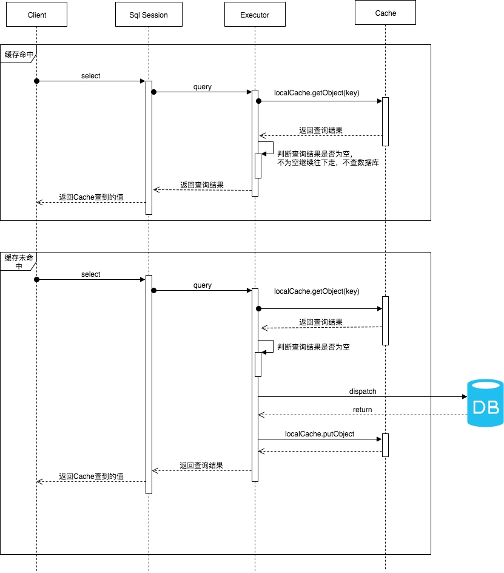

title: Mybatis源码解析(5)--一级缓存机制
layout: post
date: 2018-02-16 17:29:32
comments: true
categories: Mybatis源码解析
tags: 
    - 源码解析
    - Mybatis
    
keywords: “Mybatis”, "缓存机制"
description: 在一个应用，我们有可能会反复地执行完全相同的查询语句，而且这些查询内容可能变化很小。尽管存在数据库连接池，而每次一次查询都需要经过网络传输、数据库执行sql操作等。如果这种查询过于频繁，那么会造成大量的资源浪费。为了解决这个问题Mybatis提供了一级缓存和二级缓存。每次查询先查询缓存，如果缓存中有数据就不用从数据库中获取，大大提高系统性能。

---

# 一.介绍
在一个应用，我们有可能会反复地执行完全相同的查询语句，而且这些查询内容可能变化很小。尽管存在数据库连接池，而每次一次查询都需要经过网络传输、数据库执行sql操作等。如果这种查询过于频繁，那么会造成大量的资源浪费。为了解决这个问题Mybatis提供了一级缓存和二级缓存。每次查询先查询缓存，如果缓存中有数据就不用从数据库中获取，大大提高系统性能。

**一级缓存**：一级缓存是SqlSession级别的缓存。在操作数据库时需要构造sqlSession对象，在sqlSession对象中有一个数据结构（HashMap）用于存储缓存数据。不同的sqlSession之间的缓存数据区域（HashMap）是互相不影响的。


**二级缓存**:二级缓存是mapper级别的缓存，多个SqlSession去操作同一个Mapper的sql语句，多个SqlSession可以共用二级缓存，二级缓存是跨SqlSession的。


# 二. 一级缓存
为了避免在一个会话中多次重复执行相同的sql,提高查询性能，Mybatis提供了一级缓存。为每个一个SqlSession对象创建一个本地缓存(local cache)，对于每一次查询，都会尝试根据查询的条件去本地缓存中查找是否在缓存中。如果在缓存中，就直接从缓存中取出，然后返回给用户；否则，从数据库读取数据，将查询结果存入缓存并返回给用户。


## 2.1 数据结构和实现
SqlSession只是一个MyBatis对外的接口，每个SqlSession的执行都会交给Executor执行器这个角色来完成，负责完成对数据库的各种操作。而Executor维护这一级缓存Cache。SqlSession、Executor、Cache之间的关系如下列类图所示：


由上图可知，一级缓存实际实现类是PerpetualCache，由PerpetualCache来维护。PerpetualCache实现原理其实很简单，其内部就是通过一个简单的HashMap<k,v> 来实现的，没有其他的任何限制。如下是PerpetualCache的实现代码：

```
private Map<Object, Object> cache = new HashMap<Object, Object>();

// 存放
@Override
public void putObject(Object key, Object value) {
    cache.put(key, value);
}

// 取出
@Override
public Object getObject(Object key) {
    return cache.get(key);
}
```
## 2.2 如何开启一级缓存
开发者只需在MyBatis的配置文件中，添加如下语句，就可以使用一级缓存。共有两个选项:
 - SESSION.默认是SESSION级别，即在一个MyBatis会话中执行的所有语句，都会共享这一个缓存。
 - STATEMENT可以理解为缓存只对当前执行的这一个Statement有效。

```
<setting name="localCacheScope" value="SESSION"/>
```

## 2.3 实现原理



上图是用户从使用SqlSession到最后调用缓存的交互图，主要流程是：

 1. 对于某个查询，根据statementId,params,rowBounds来构建一个key值，根据这个key值去缓存Cache中取出对应的key值存储的缓存结果；
 2. 判断从Cache中根据特定的key值取的数据数据是否为空，即是否命中；
 3. 如果命中，则直接将缓存结果返回；
 4. 如果没命中：
    4.1 去数据库中查询数据，得到查询结果；
    4.2 将key和查询到的结果分别作为key,value对存储到Cache中；
    4.3 将查询结果返回；
 5. 结束。

读者可以根据交互图去阅读源码，或参考我之前博文：
[Mybatis源码解析(3)--SqlSession工作过程分析](http://zhengjianglong.cn/2018/02/15/mybatis/Mybatis%E6%BA%90%E7%A0%81%E8%A7%A3%E6%9E%90(3)--SqlSession%E5%B7%A5%E4%BD%9C%E8%BF%87%E7%A8%8B%E5%88%86%E6%9E%90/) 这篇文章已经介绍过了sqlSession的执行过程。这里我们从以下几个方面去分析源码:

 1. 缓存key的生成
 2. 查询
 3. 缓存的容量大小，如果超过指定数目如何处理
 4. 缓存生命周期如何

### 2.3.1 CacheKey
Mybatis的缓存是根据CacheKey进行存取，那CacheKey是如何生成的？CacheKey取决于哪些数据呢？

只有两次查询在数据库中查询语句一致，才能将第一次缓存的结果作为第二次查询的结果，保证数据一致。MyBatis的数据库查询语句由statementID、参数、分页情况等决定。因此MyBatis认为，对于两次查询，如果以下条件都完全一样，那么就认为它们是完全相同的两次查询：

 - **传入的 statementId **: 如cn.zhengjianglong.ssmdemo.mapper.StudentMapper.findStudentById()。一个statementId，决定了你将执行什么样的Sql。
 - 查询时要求的结果集中的结果范围 （结果的范围通过rowBounds.offset和rowBounds.limit表示）。 即如果是一个list查询，那么查找同一页，相同的每页查询条数也一致。MyBatis自身提供的分页功能是通过RowBounds来实现的，它通过rowBounds.offset和rowBounds.limit来过滤查询出来的结果集。
 - 这次查询所产生的最终要传递给JDBC java.sql.Preparedstatement的Sql语句字符串（boundSql.getSql() ）。Mybatis支持动态SQL，因此同一个statementId，可能传入的参数不同最后得到的SQL语句也会有所不同。
 - 传递给java.sql.Statement要设置的参数值。对于同一个SQL下，所需的参数值必须保持一致，这样查询的结果是一致的。

综上所述，CacheKey由以下条件决定：statementId + rowBounds + 传递给JDBC的SQL + 传递给JDBC的参数值；

因此CashKey构造如下，在调用update方法的时候在更新CacheKey的hashCode值：
```
CacheKey cacheKey = new CacheKey();
// 1.statementId
cacheKey.update(ms.getId());
// 2. rowBounds.offset
cacheKey.update(rowBounds.getOffset());
// 3. rowBounds.limit
cacheKey.update(rowBounds.getLimit());
// 4. SQL语句
cacheKey.update(boundSql.getSql());
// 5. 将每一个要传递给JDBC的参数值也更新到CacheKey中
List<ParameterMapping> parameterMappings = boundSql.getParameterMappings();
TypeHandlerRegistry typeHandlerRegistry = ms.getConfiguration().getTypeHandlerRegistry();
// mimic DefaultParameterHandler logic
for (ParameterMapping parameterMapping : parameterMappings) {
  if (parameterMapping.getMode() != ParameterMode.OUT) {
    Object value;
    String propertyName = parameterMapping.getProperty();
    if (boundSql.hasAdditionalParameter(propertyName)) {
      value = boundSql.getAdditionalParameter(propertyName);
    } else if (parameterObject == null) {
      value = null;
    } else if (typeHandlerRegistry.hasTypeHandler(parameterObject.getClass())) {
      value = parameterObject;
    } else {
      MetaObject metaObject = configuration.newMetaObject(parameterObject);
      value = metaObject.getValue(propertyName);
    }
    // 设置参数，更新
    cacheKey.update(value);
  }
}
```

### 2.3.2 CacheKey的hashcode生成算法和equals方法
Cache接口的实现，本质上是使用的HashMap<k,v>,而构建CacheKey的目的就是为了作为HashMap<k,v>中的key值。

能作为Map的Key对象必须实现hashcode和equals方法。利用hashcode方法计算对象在Map中的桶位置。当元素多了存在冲突，那么同一个桶里就有多个元素，通过key对象的equals进行比较，确定是属于当前元素。

因此CacheKey需要实现hashCode接口和equals。CacheKey的hashCode方法直接返回了haseCode：

```
@Override
public int hashCode() {
    return hashcode;
}
```

那hashcode又是如何计算得到的呢？CacheKey提供了一个update方法，每次设置值的时候就会更新一次hashCode值。

```
public void update(Object object) {
    //1. 得到对象的hashcode;    
    int baseHashCode = object == null ? 1 : ArrayUtil.hashCode(object); 
   
    // 对象计数递增 
    count++;
    checksum += baseHashCode;
    
    // 2. 对象的hashcode 扩大count倍  
    // 通过这个count来体现每个参数的顺序概念，使得即使每次传入相同的值，因为顺序不同所以得到的hashCode也会有所不同
    baseHashCode *= count;

    // 3. hashCode * 拓展因子（默认37）+拓展扩大后的对象hashCode
    hashcode = multiplier * hashcode + baseHashCode;
    updateList.add(object);
}
```

CacheKey计算hashCode的时候调用update，hashCode值取决于调用的顺序，以及在每个顺序上的值。因此如果不同顺序位置加入了相同的值，应该体现出这些值在hashCode上的差距。否则就会出现不一致问题。因此在hashCode的计算上时，每次计算出传入的参数hashCode后再乘以当前已经计算的count，体现了这个参数的顺序概念。

```
 baseHashCode *= count;
```

例如假设 "value" 的 ArrayUtil.hashCode()值为 1
     
cacheKey.update(“value”); // baseHashCode=1
cacheKey.update(“value”); // baseHashCode=2
cacheKey.update(“value”); // baseHashCode=3

## 2.4 一级缓存的生命周期
1. 一级缓存的生命周期在一个SqlSesion内，随着SqlSeesion对象的创建而存在，随着SqlSession的关闭而消失。因此MyBatis在开启一个数据库会话时，会创建一个新的SqlSession对象，SqlSession对象中会有一个新的Executor对象，Executor对象中持有一个新的PerpetualCache对象；当会话结束时，SqlSession对象及其内部的Executor对象还有PerpetualCache对象也一并释放掉。


2. SqlSession调用了close()方法，会释放掉一级缓存PerpetualCache对象，一级缓存将不可用；SqlSession调用了BaseExecutor的close方法。在close方法中会将缓存、事务等对象设置为null 这样便于JVM清除。

    ```
    transaction = null;
    deferredLoads = null;
    localCache = null;
    localOutputParameterCache = null;
    ```

3. 如果SqlSession调用了clearCache()，会清空PerpetualCache对象中的数据，但是该对象仍可使用；

    ```
    @Override
      public void clearLocalCache() {
        if (!closed) {
          localCache.clear();
          localOutputParameterCache.clear();
        }
    }
    ```
    
4. **SqlSession中执行了任何一个update操作(update()、delete()、insert()) **，都会清空PerpetualCache对象的数据，但是该对象可以继续使用；delete/insert最终都会调用update。 在update中包含了clearLocalCache()的操作。

    ```
    @Override
    public int update(MappedStatement ms, Object parameter) throws SQLException {
        ErrorContext.instance().resource(ms.getResource()).activity("executing an update").object(ms.getId());
        if (closed) {
          throw new ExecutorException("Executor was closed.");
        }
        clearLocalCache();
        return doUpdate(ms, parameter);
    }
    ```


## 2.4 一级缓存的性能分析
Mybatis缓存只有了HashMap实现，没有做任何限制：大小和容量等。如果通过一个SqlSession查询大量的数据，那么可能会造成OutOfMemoryError问题。

一级缓存使用建议:

 - 对于数据变化频率很大，并且需要高时效准确性的数据要求，我们使用SqlSession查询的时候，要控制好SqlSession的生存时间，SqlSession的生存时间越长，它其中缓存的数据有可能就越旧，从而造成和真实数据库的误差；同时对于这种情况，用户也可以手动地适时清空SqlSession中的缓存；
 - 对于只执行、并且频繁执行大范围的select操作的SqlSession对象，SqlSession对象的生存时间不应过长。

# 参考
- Mybatis 源码
- [聊聊MyBatis缓存机制](https://tech.meituan.com/mybatis_cache.html) | 包含了很多验证示例，源码分析
- [终结篇：MyBatis原理深入解析（三）](https://www.jianshu.com/p/cf32582169db)
- [mybatis一级与二级缓存详解](https://www.cnblogs.com/cuibin/articles/6827116.html) 


