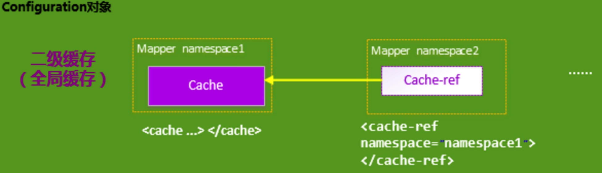

title: Mybatis源码解析(6)--二级缓存机制
layout: post
date: 2018-02-16 23:17:32
comments: true
categories: Mybatis源码解析
tags: 
    - 源码解析
    - Mybatis
    
keywords: “Mybatis”, "缓存机制"
description: MyBatis的二级缓存相对于一级缓存来说，实现了SqlSession之间缓存数据的共享，同时粒度更加的细，能够到namespace级别，通过Cache接口实现类不同的组合，对Cache的可控性也更强。

---

# 一. 介绍

二级缓存使得多个SqlSession之间可以共享缓存。开启二级缓存后，会使用CachingExecutor装饰Executor。数据的查询执行的流程就是**二级缓存 -> 一级缓存 -> 数据库**。具体流程如图所示：


当开一个会话时，一个SqlSession对象会使用一个Executor对象来完成会话操作，MyBatis的二级缓存机制的关键就是对这个Executor对象做文章。如果用户配置了"cacheEnabled=true"，那么MyBatis在为SqlSession对象创建Executor对象时，会对Executor对象加上一个装饰者：CachingExecutor，这时SqlSession使用CachingExecutor对象来完成操作请求。CachingExecutor对于查询请求，会先判断该查询请求在Application级别的二级缓存中是否有缓存结果，如果有查询结果，则直接返回缓存结果；如果缓存中没有，再交给真正的Executor对象来完成查询操作，之后CachingExecutor会将真正Executor返回的查询结果放置到缓存中，然后在返回给用户。


CachingExecutor是Executor的装饰者，以增强Executor的功能，使其具有缓存查询的功能，这里用到了设计模式中的装饰者模式.

  
## 1.1 二级对象分类
MyBatis并不是简单地对整个Application就只有一个Cache缓存对象，它将缓存划分的更细，即是**Mapper(namespace)**级别的.因此二级缓存可以分为两类:

  - 为每一个Mapper分配一个Cache缓存对象.（使用<cache>节点配置）
  - 多个Mapper共用一个Cache缓存对象（使用<cache-ref>节点配置）
  
  
  对于每一个Mapper.xml,如果在其中使用了<cache> 节点，则MyBatis会为这个Mapper创建一个Cache缓存对象。

### 1.1.1 一个Mapper分配一个Cache（<cache>）
MyBatis将Application级别的二级缓存细分到Mapper级别，即对于每一个Mapper.xml,如果在其中使用了<cache> 节点，则MyBatis会为这个Mapper创建一个Cache缓存对象.每一个Cache对象，都会有一个自己所属的namespace命名空间，并且会将Mapper的 namespace作为它们的ID；


### 1.1.2 多个Mapper共用一个Cache (<cache-ref>)
使用<cache-ref namespace="">节点，来指定你的这个Mapper使用到了哪一个Mapper的Cache缓存, 这样能够做到多个Mapper共用一个Cache缓存对象。



## 1.2 如何设置
如何设置才能使Mybatis具有二级缓存功能呢？

1. 开启MyBatis支持二级缓存的总开关：cacheEnabled=true
    ```
    <setting name="cacheEnabled" value="true"/>
    ```
2. 在Mapper.xml文件中，对需要支持二级缓存的select语句配置了<cache> 或<cached-ref>节点；
3. 并且该select语句的参数 useCache=true
 ```
 // StudentMapper.xml
 <select id="findAllStudents" resultMap="StudentResult" useCache="true">
        SELECT * FROM STUDENTS
        <cache> 
 </select>
 ```
 
 Mybatis对缓存的支持非常灵活，MyBatis提供了三种二级缓存的选择:
 
 1. **MyBatis自身提供的缓存实现**；并提供了各种缓存刷新策略如LRU，FIFO等等；
 2. **用户自定义的Cache接口实现**；用户实现org.apache.ibatis.cache.Cache接口，然后将Cache实现类配置在<cache type="">节点的type属性上即可；type中可以设置别名或者全限定名。
 3. **跟第三方内存缓存库的集成**；


# 二. 二级缓存实现原理

MyBatis二级缓存的一个重要特点：**即松散的Cache缓存管理和维护**。一个Mapper中定义的增删改查操作只能影响到自己关联的Cache对象，不影响其他Cache对象。因此Mapper之间的缓存关系比较松散，相互关联的程度比较弱。

如果多个Mapper公共一个缓存，是否任意一个Mapper更新操作都会清空缓存呢？比如AMapper和BMapper共用一个Cache对象，AMapper和BMapper的任意的更新操作都会将共用的Cache清空，这样会频繁地清空Cache，导致Cache实际的命中率和使用率就变得很低了，所以这种策略实际情况下是不可取的。因此Mybatis采用另一套策略，当对于某些表执行了更新(update、delete、insert)操作后，不是清空所有缓存，而是清空跟这些表有关联的查询语句所造成的缓存；

MyBatis二级缓存的工作流程和前文提到的一级缓存类似，只是在一级缓存处理前，用CachingExecutor装饰了BaseExecutor的子类，在委托具体职责给delegate之前，实现了二级缓存的查询和写入功能。

## 2.1 数据结构
二级缓存是针对Mapper级别，对每个mapper都会创建一个缓存。MappedStatement对象存储一个mapper的所有信息，并保存在configuration中。在MappedStatement类中利用cache字段来存储缓存信息。

```
private Cache cache;
```

## 2.2 初始化CachingExecutor

CachingExecutor的初始化需要从sqlSession对象的创建说起，一个sqlSession对象拥有一个Executor对象。因此在创建sqlSession的同时创建Executor对象。下面是SqlSession对象的创建代码：

```
// 创建SqlSession   sqlSessionFactory是DefaultSqlSessionFactory
SqlSession sqlSession = sqlSessionFactory.openSession();
```

SqlSession在创建过程的时候会同时创建事务和Executor：

```
final Environment environment = configuration.getEnvironment();
// 创建事务
final TransactionFactory transactionFactory = getTransactionFactoryFromEnvironment(environment);
tx = transactionFactory.newTransaction(environment.getDataSource(), level, autoCommit);
// 创建 Executor
final Executor executor = configuration.newExecutor(tx, execType);
return new DefaultSqlSession(configuration, executor, autoCommit);
```

configuration的newExecutor方法会根据缓execType类型创建不同的Excutor, 最后如果发现配置中开启了二级缓存，那么就会用装饰器CachingExecutor包装executor，具体代码如下：

```
public Executor newExecutor(Transaction transaction, ExecutorType executorType) {
    executorType = executorType == null ? defaultExecutorType : executorType;
    executorType = executorType == null ? ExecutorType.SIMPLE : executorType;
    Executor executor;
    if (ExecutorType.BATCH == executorType) {
      executor = new BatchExecutor(this, transaction);
    } else if (ExecutorType.REUSE == executorType) {
      executor = new ReuseExecutor(this, transaction);
    } else {
      executor = new SimpleExecutor(this, transaction);
    }
    
    // 如果设定了二级缓存，用装饰类CachingExecutor进行包装
    if (cacheEnabled) {
      executor = new CachingExecutor(executor);
    }
    executor = (Executor) interceptorChain.pluginAll(executor);
    return executor;
  }
```


## 2.3 CachingExecutor缓存获取过程
源码分析从CachingExecutor的query方法展开，在query方法主要逻辑：

 1. 首先会从MappedStatement中获得在配置初始化时赋予的Cache
 2. 如果Cache不为空，表示该MappedStatement开启了二级缓存设置：
 
   1. 判断是否需要刷新缓存
   2. 处理存储过程
   3. 从二级缓存中获取数据，如果存在则直接返回。
   4. 否则交给BaseExecutor执行，一级缓存逻辑一致。并将结果存到二级缓存中
 3. 否则交给BaseExecutor执行，一级缓存逻辑一致
 
```
public <E> List<E> query(MappedStatement ms, Object parameterObject, RowBounds rowBounds, ResultHandler resultHandler, CacheKey key, BoundSql boundSql)
      throws SQLException {
    // 1. 获取二级缓存器，缓存是针对mapper的，因此直接从MappedStatement中获取
    Cache cache = ms.getCache();
    if (cache != null) {
      // 2. 判断是否需要刷新缓存
      flushCacheIfRequired(ms);

      if (ms.isUseCache() && resultHandler == null) {
        // 3. ensureNoOutParams主要是用来处理存储过程的
        ensureNoOutParams(ms, boundSql);
        @SuppressWarnings("unchecked")
        // 4. 从tcm中获取缓存的
        List<E> list = (List<E>) tcm.getObject(cache, key);
        if (list == null) {
          /**
           * 否则和之前一级缓存思路一样。
           * 1. 先查询一级缓存是存在，如果存在，则直接返回
           * 2. 如果不存在，则从数据库查询，并保存到一级缓存中
           */
          list = delegate.<E> query(ms, parameterObject, rowBounds, resultHandler, key, boundSql);

          /**
           * 保存到二级缓存中
           */
          tcm.putObject(cache, key, list); // issue #578 and #116
        }
        return list;
      }
    }
    /**
     * 如果这个MapperStatement没开启缓存：
     * 否则和之前一级缓存思路一样。
     * 1. 先查询一级缓存是存在，如果存在，则直接返回
     * 2. 如果不存在，则从数据库查询，并保存到一级缓存中
     */
    return delegate.<E> query(ms, parameterObject, rowBounds, resultHandler, key, boundSql);
  }
```

这里有几个重要的点需要说明：

 1. Cache何时被设置到MappedStatement中
 2. flushCacheIfRequired如何刷新缓存
 3. TransactionalCacheManager如何获取缓存数据，即上文的tcm
 
### 2.3.1 初始化MappedStatement的Cache
XMLMapperBuilder在解析Mapper.xml文件时，如果遇到<cache/> 或<cache-ref>节点，则在解析的时候会初始化Cache:

```
// 给定命名空间的缓存配置。
cacheElement(context.evalNode("cache"));
// 其他命名空间缓存配置的引用
cacheRefElement(context.evalNode("cache-ref"));
```

<cache/> 节点会调用builderAssistant对象，构建缓存对象，并保存到MappedStatement对象和configuration对象中:

```
 builderAssistant.useNewCache(typeClass, evictionClass, flushInterval, size, readWrite, blocking, props);
```

保存到configuration中:

```
configuration.addCache(cache);
```
 
 <cache-ref>节点在解析的时候，会根据ref引用的namespace，则直接从configuration中获取缓存对象。然后保持到MappedStatement对象中。
 
 ```
 Cache cache = configuration.getCache(namespace);
 ```
 
Mybatis内置了多个Cache实现，Cache采用了装饰类模式。以下是具体这些Cache实现类的介绍，他们的组合为Cache赋予了不同的能力:

 - SynchronizedCache： 同步Cache，实现比较简单，直接使用synchronized修饰方法。
 - LoggingCache： 日志功能，装饰类，用于记录缓存的命中率，如果开启了DEBUG模式，则会输出命中率日志。
 - SerializedCache： 序列化功能，将值序列化后存到缓存中。该功能用于缓存返回一份实例的Copy，用于保存线程安全。
 - LruCache： 采用了Lru算法的Cache实现，移除最近最少使用的key/value。
 - PerpetualCache： 作为为最基础的缓存类，底层实现比较简单，直接使用了HashMap。

### 2.3.2 TransactionalCacheManager
MyBatis的CachingExecutor持有了TransactionalCacheManager，即上述代码中的tcm。可以理解使负责管理TransactionalCache的类。TransactionalCache是什么呢？ TransactionalCache实现了Cache接口，CachingExecutor会默认使用他包装初始生成的Cache，作用是如果事务提交，对缓存的操作才会生效，如果事务回滚或者不提交事务，则不对缓存产生影响。TransactionalCache是一个事务类型的缓存实现类，用于维护二级缓存数据。因此，TransactionalCacheManager中持有了一个Map，代码如下所示：

```
private final Map<Cache, TransactionalCache> transactionalCaches = new HashMap<Cache, TransactionalCache>();
```


这个Map保存了Cache和用TransactionalCache包装后的Cache的映射关系，通过Cache获取对应的缓存TransactionalCache。用Cache表示一个namespace对应的缓存，作为该namespace的唯一标志。而TransactionalCache是该namespace真正的缓存。

TransactionalCacheManager中有几个重要的方法：

 - commit 提交
 - rollback 回滚
 - putObject 存放到二级缓存中。首先获取获取Cache对应的TransactionalCache，然后将数据保存到TransactionalCache中:

  ```
  public void putObject(Cache cache, CacheKey key, Object value) {
    getTransactionalCache(cache).putObject(key, value);
  }
  private TransactionalCache getTransactionalCache(Cache cache) {
    TransactionalCache txCache = transactionalCaches.get(cache);
    if (txCache == null) {
      txCache = new TransactionalCache(cache);
      transactionalCaches.put(cache, txCache);
    }
    return txCache;
  }
  ```
- getObject 获取二级缓存数据。putObject类似，首先获取TransactionalCache，然后在从TransactionalCache中根据key去查询数据。
  ```
  public Object getObject(Cache cache, CacheKey key) {
    return getTransactionalCache(cache).getObject(key);
  }
  ```
- clear 清空缓存，清空了需要在提交时加入缓存的列表，同时设定提交时清空缓存。
  ```
  public void clear(Cache cache) {
    getTransactionalCache(cache).clear();
  }
  ```


### 2.3.3 flushCacheIfRequired

在默认的设置中SELECT语句不会刷新缓存，insert/update/delte会刷新缓存。这边直接调用了TransactionalCacheManager的clear方法。

```
private void flushCacheIfRequired(MappedStatement ms) {
    Cache cache = ms.getCache();
    if (cache != null && ms.isFlushCacheRequired()) {      
      tcm.clear(cache);
    }
}
```
 
## 2.4 二级缓存生命周期

# 总计
 - MyBatis的二级缓存相对于一级缓存来说，实现了SqlSession之间缓存数据的共享，同时粒度更加的细，能够到namespace级别，通过Cache接口实现类不同的组合，对Cache的可控性也更强。
 - MyBatis在多表查询时，极大可能会出现脏数据，有设计上的缺陷，安全使用二级缓存的条件比较苛刻。
 - 在分布式环境下，由于默认的MyBatis Cache实现都是基于本地的，分布式环境下必然会出现读取到脏数据，需要使用集中式缓存将MyBatis的Cache接口实现，有一定的开发成本，直接使用Redis,Memcached等分布式缓存可能成本更低，安全性也更高。


# 参考
- Mybatis 源码
- [聊聊MyBatis缓存机制](https://tech.meituan.com/mybatis_cache.html) | 包含了很多验证示例，源码分析
- [终结篇：MyBatis原理深入解析（三）](https://www.jianshu.com/p/cf32582169db)
- [mybatis一级与二级缓存详解](https://www.cnblogs.com/cuibin/articles/6827116.html) 


